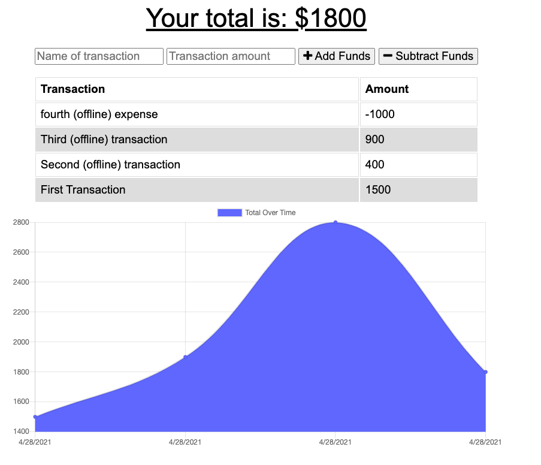
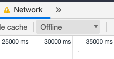

# Budget Tracker

## Week 19 Challenge

### Victor McGuire

## Table of Contents

1. [Description](#Description)
2. [Installation Instructions](#Installation-Instructions)
3. [Usage Instructions](#Usage-Instructions)
4. [Questions](#Questions)

## Description

The purpose of this project is to create a budget tracker to log my withdrawls and expenses regardless of whether or not I am online. This will enable me to ensure an accurate account balance while traveling.

## Installation Instructions

Access the application by accessing it here and downloading the files: https://github.com/vmcguire/budget_tracker

You will need to install the required dependenices here: compression, express, mongoose, and morgan.

## Usage Instructions

### Screen Shots Below:

#### Here is a sample of the interface. You can insert the name of the transaction and transaction amount to add or subtract funds.

#### If you wish to test offline mode, feel free to navigate to the DevTools under Network as see here:

#### Enjoy the budget tracker!

## Questions

Please visit my repo here for any further questions: <https://github.com/vmcguire>

My email address is: <victor.mcguire@gmail.com>
